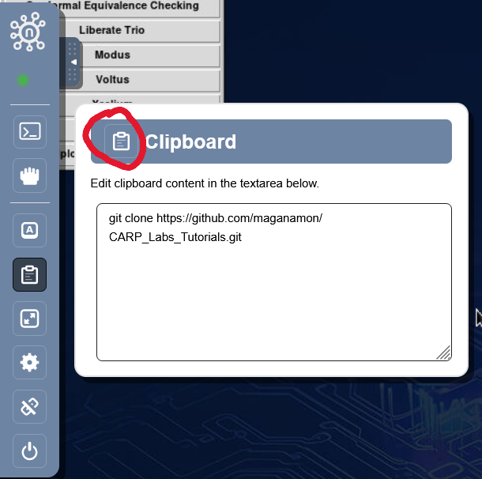
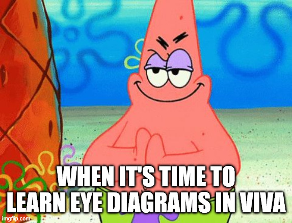

.. raw:: html

    <h1 style="text-align: center;">Lab 1 SERDES: Cadence Basics</h1>

The premise of this lab is for you to:

1. Get you used to using Cadence Simulation
2. View an Eye Diagram

You will find that there are *some* similarities to Vivado.

There are some annoyances with the copy / paste, but I'll show you how to deal with that.

Pre-requisites
-----------------

1. Go get access to the Cadence tools
    - Create an account using your school email at ``nanhub.org``
    - Go to: ``https://nanohub.org/groups/cadence_access`` and request access
    - Wait to be accepted

Let's Get Started
-------------------

My entry is always:
    - ``https://nanohub.org/groups/cadence_access``

Click on **Digital Implementation** 

Now. Before we start, on the Top Right click on ``Go to Access Wave`` this will open
the Cadence Tools in a new tab in a Windowed Full Screen. (A lot more pleasent to look at)

Open the Left menu bar. You'll find the clipboard tab as well.

Open a Terminal if there's not already one open.

----

There's 2 ways to import the folder you need

1. Git Clone (Easy)
    - You will use the clipboard tab

2. Create a Zip-File of the Folder and import it
    - You will need to move the folder once you import it
    - For when youi have a local folder and don't want to make a github repo

We'll be using the Git Clone method.

You won't be able to ``ctrl + v`` into the terminal.

Paste what you want into the box and click the clipboard icon on the top left.

Use:
    - ``git clone https://github.com/maganamon/CARP_Labs_Tutorials.git``

You will only need the **SerDes_Labs** Directory

I have a bunch of useless folders and files so you can get rid of them with:
    - rm -rf FOLDER_NAME
    - rm FILE_NAME

Now ``cd`` chain yourself all the way to:
    - SerDes_Labs -> Lab1_Parrallel_vs_Serial -> SerDes_TxRx

Now we're going to open Xcelium using the terminal with:
    - Make sure it's all 1 line. I split it for website formating reasons.

.. code-block:: rst

    xrun -64bit -sv -access +rwc -gui -top tb_top_level_serdes Serializer_tx.sv Deserializer_rx.sv
    top_level_serdes.sv tb_top_level_serdes.sv

The file after ``-top`` indicates the toplevel module.

All other listed files are the modules that the top level will need.

I have already written a basic Serializer and Deserializer then had ChatGPT write the Testbench.

**Congrats**

The simulation should now be open.

.. note::

    "Send to Waveform"

    1. Add All DUT (Top Level) Signals
    2. Dut -> Serial

    - Add loaded_data, counter

What we will learn
--------------------

    - Sim Console "run XXXns"
    - Moving by Edge
    - Under "Cursor" tab. Changing Radix
    - Follow the Hex 55 Example
    - Colors, Groups, Dividers
    - Search for Values

Eye Diagram Time
------------------

*Virtuoso: ViVa* where ViVA stands for Virtuoso Visualization and Analysis Tool

Open Up that Bash Terminal again and run:
    - ``viva &``
    - Give it a minute cause that 'ish is slow

Click the Folder Icon on the Left under the Browser tab.

    .. image:: images/viva_ss1.png
        :width: 40%
        :align: center

- Expand the folder on the botton until you get to the Top_Level Folder.
- Click it, and look for the **serial_data** signal. Double Click the Signal.

You should see the signal and a bunch of 0 and 1 wave forms.

- Click the **Measurements** tab at the very top
- Then click **Digital to Analog**

Logic High: 1 V         Logic Low: 0 V
Rise Time: 1ps          Fall Time: 1ps

We have created essentially a perfect circuit with these parameters.

- Click the **Measurements** tab again at the very top
- Then click **Eye Diagram**
- Unit Interval for 100Mhz Clk = **10ns**

The Unit Interval tells Cadence how often to chop up the waveform and overlay them on top on each other

- Finally click **plot eye**

You should see something like this:

    .. image:: images/perfect_eye_lab1.png
        :width: 70%
        :align: center

On the Right is the eye diagram, and on the left the Analog signal (When we went from Digital
to Analog)

notice... That doesn't look like an eye? Why is that?

Let's try some different parameters

Logic High: 1 V         Logic Low: 0 V
Rise Time: 500ps        Fall Time: 500ps

    .. code-block:: rst

        100 MHz  → UI = 10 ns
        500 MHz  → UI = 2 ns
        1 GHz    → UI = 1 ns
        2 GHz    → UI = 500 ps

That's all for today. Lab 2 we'll see the real eye diagram.

.. raw:: html

       