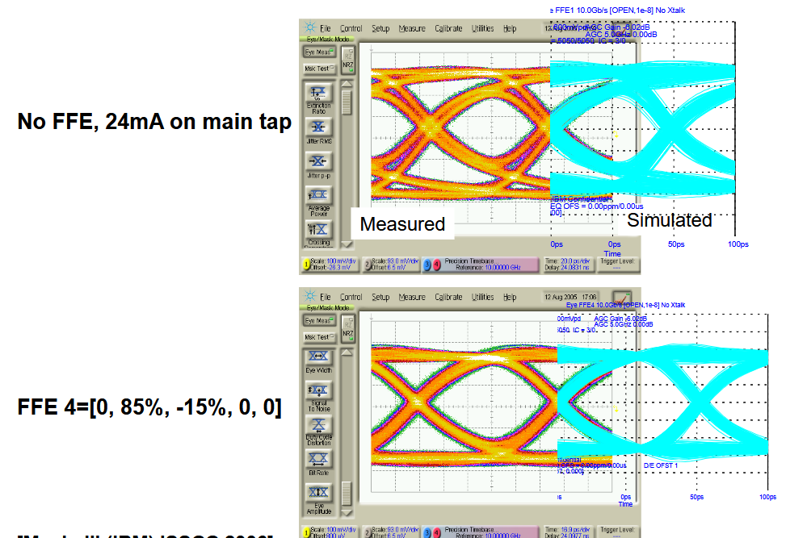
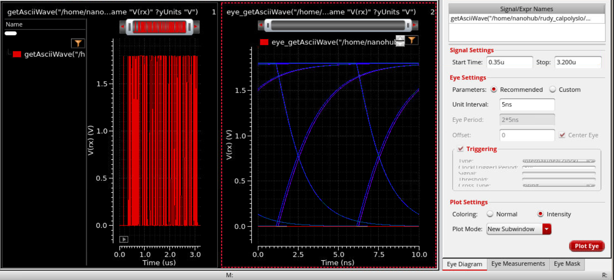

Real Eye Diagram: Skywater PDK
----------------------------------

So last lab we saw the comically perfectly square eye diagram.

This time we're going to use use Cadence tools to go from:

RTL -> Logic Gates -> Standard Cells -> Place and Routing -> Eye Diagram

We'll see the true eye diagram and if time permits it to me, we'll try to purposely close it by
ramping up the bit rate.

One interesting image I wanted to show from the High Speed Links Texas A&M Course (https://people.engr.tamu.edu/spalermo/ecen720.html):

We can see how with good simulation we can get close to the real thing. Also how we can improve the width
and height of the eye. More on that later though. Let's put a pin in it for now.

Load Skywater PDK into Genus
--------------------------------

``cd ..`` command yourself until you're inside Lab1_Serial_vs_Parallel and outside Serdes_TxRx.

command ``ls`` should show 2 directories Parallel_Tx and Serdes_TxRx

We'll need to download the SkyWater PDK (No the whole she-bang, just what we need):

.. note::

    Commands to run:

    - git clone --depth 1 --no-checkout https://github.com/The-OpenROAD-Project/OpenROAD-flow-scripts.git sky130_orfs

    - cd sky130_orfs

    - git config core.sparseCheckout true

    - echo "flow/platforms/sky130hd/lib/" > .git/info/sparse-checkout

    - git read-tree -mu HEAD

    - ls flow/platforms/sky130hd/lib

 After the last command you should see:

    ``sky130_fd_sc_hd__tt_025C_1v80.lib``

``cd`` INTO Serdes_TxRx

Now open Genus with: ``genus``

.. note::

    Next Set of Commands to run in Genus:

    - set_db library ../sky130_orfs/flow/platforms/sky130hd/lib/sky130_fd_sc_hd__tt_025C_1v80.lib

    - read_hdl -sv Serializer_tx.sv

    - read_hdl -sv Deserializer_rx.sv

    - read_hdl -sv top_level_serdes.sv

    - elaborate top_level_serdes

Verify with:

- get_db current_design .name

You should see something like: ``top_level_serdes``

RTL -> Logic Gates -> Standard Cells
-------------------------------------

Now let's make a 100Mhz Clk.

- create_clock -name SERDES_CLK -period 10 [get_ports CLK]

Now, let's synthesize to Logic Gates

RTL -> Logic Gates

- ``syn_generic``

We can see the logistics with

 - ``report_area``

Now, let's map the gates to cells

Logic Gates -> Standard Cells

- ``syn_map``

Logistics Check:

    - ``report_gates``

    - ``report_area``

    - ``report_timing``

We have our Netlist in Genus. Now we have to export the Netlist.

    - ``exec mkdir -p genus_out``

    - ``write_hdl > genus_out/top_level_serdes_mapped.v``

    - ``write_sdc > genus_out/top_level_serdes.sdc``

The SDF File
--------------

Now we need an SDF File. Which will give us the timing contrainsts of these
SkyWater130 standard cells, so that we can simulate it.

.. note::

    Conceptually:

        SKY130 DFF

        clock-to-Q = 0.18 ns

        |

        SKY130 MUX

        A-to-X = 0.12 ns

        etc.
    
    Will become info in out SDF file:

    top_level_serdes.sdf

    Now that we have the SDF file with these timing constraints. We can go back
    to Xcellium to simulate it.

    gate function + gate timing = timing-aware simulation

    Next, we will run:

        - ``write_sdf > genus_out/top_level_serdes.sdf``

        - ``exec ls -lh genus_out``

    you should see something like:

    .. code-block:: rst

        READ,WRITE,EXE permissions USERNAME top_level_serdes.sdc

        READ,WRITE,EXE permissions USERNAME top_level_serdes.sdf

        READ,WRITE,EXE permissions USERNAME top_level_serdes_mapped.v

You can now exit genus with:

    - ``exit``

What we've done so far:

    .. code-block:: rst
        
        SystemVerilog RTL
            ↓
        Genus
            ↓
        SKY130 gates
            ↓
        mapped Verilog
            +
        SDF timing

In the terminal we can run:
    - ``cat genus_out/top_level_serdes_mapped.v``

To see the verilog file with the SkyWater Standard Cells

Xcelium doesn't know what to do with these Standard Cells, so we have
to give it the timing information.

    - ``git clone --depth 1 https://github.com/google/skywater-pdk-libs-sky130_fd_sc_hd.git sky130_sc_hd``
    - ``ls sky130_sc_hd``
        - Should reveal 3 directories: cells, models, timing
    - ``git clone https://github.com/maganamon/sky130_models.git``

    - ``cp tb_top_level_serdes.sv tb_gate_level_serdes.sv``
    - open the gate test bench file with ``nano``
    - Delete the parameterized stuff next to the module name

    add this after module initialization:

    .. code-block:: rst
        
        `ifdef GATE_LEVEL
        initial begin
            $sdf_annotate(
                "genus_out/top_level_serdes.sdf",
                dut
            );
        end
        `endif

    .. code-block:: rst

        xrun -64bit -sv \
        -timescale 1ns/1ps \
        sky130_models/primitives.v \
        genus_out/top_level_serdes_mapped.v \
        tb_gate_level_serdes.sv \
        -v sky130_models/sky130_fd_sc_hd.v \
        -top tb_top_level_serdes \
        -access +rwc \
        -define GATE_LEVEL \
        -maxdelays \
        -sdf_verbose

!!!!! NGSpice Book Mark !!!!!!!!!
----------------------------------

    We use a Python script to turn the wave.vcd file with the timing delays into a 
    .pwl file that ngspice can use.

    - ``mv vcd_to_pwl.py ..``
    - ``python3 vcd_to_pwl.py``
    - ``cat serial_data_sdf.pwl``

    Then go to your WSL (Linux) machine and make a new Directory. Put tthe .pwl file in
    the new directory.

    You will also need to put a .cir file in there as well

    .. raw:: html

        <a href="files/sdf_electrical_eye.cir" download>
            Download the .cir file (CLICK ME)
        </a>

    run it with:
        - ``ngspice sdf_electrical_eye.cir``

    It should have created a eye_data.txt file with the electrical data (including
    Capacitance, Resistance, and Current)

    We switched to WSL to use NGSpice because we don't have Spectre(The Cadence equivalent)

    So now we'll take this .txt file and import it into Cadence. 
    Then run an eye diagram measurement on it.

    For those who are following along at CARP:

    .. raw:: html

        <a href="files/eye_data.txt" download>
            Download the .txt file (CLICK ME)
        </a>

    - ``Import`` the .txt it will show up in your home directory

    Open Viva. 
    - ``viva &``
    - Tools Tab -> Calculator
    Paste this in:

    .. code-block:: rst

        getAsciiWave("/home/nanohub/rudy_calpolyslo/CADENCE/eye_data.txt" 1 2 ?xName "Time" ?xUnits "s" ?yName "V(rx)" ?yUnits "V")

    - Press enter
    - Plot with the Calculator and Waveform Icon. "Evaluate the buffer. If Scalar,...."

    Let's see the eye diagram:

    .. code-block:: rst

        Start: 0.3u

        100 MHz  → UI = 10 ns
        500 MHz  → UI = 2 ns
        1 GHz    → UI = 1 ns
        2 GHz    → UI = 500 ps

        Turning on Intensity is cool :)

and that's all. Thank you. :3